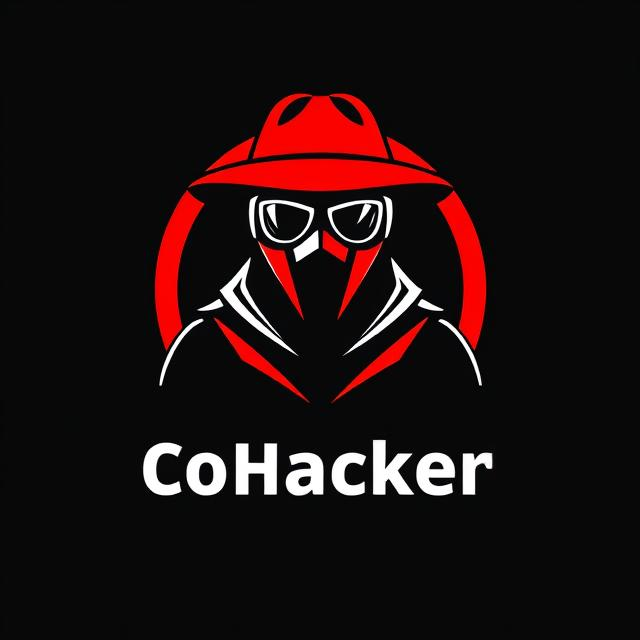
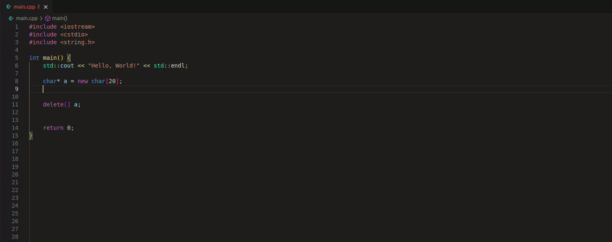
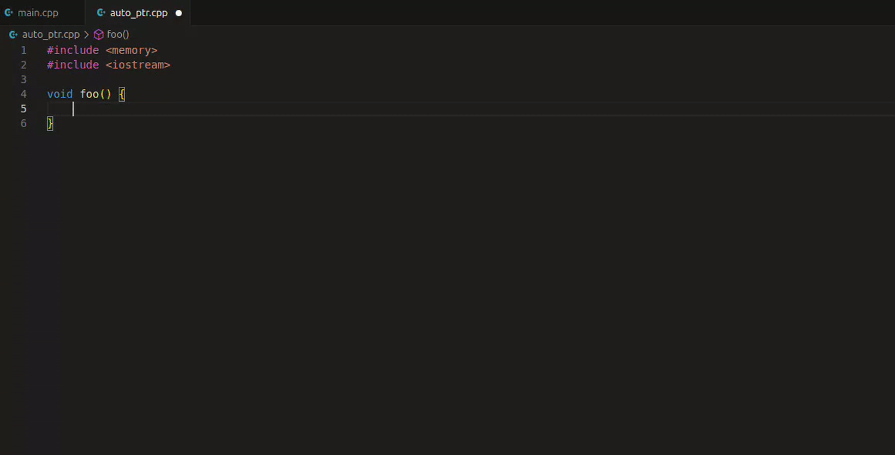
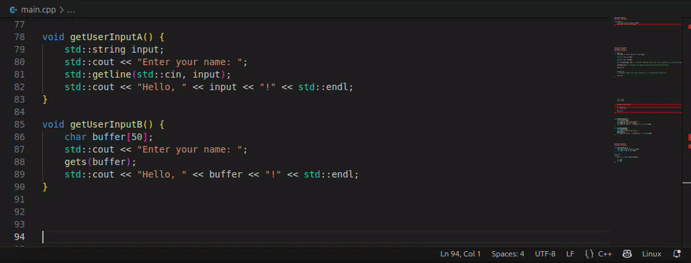
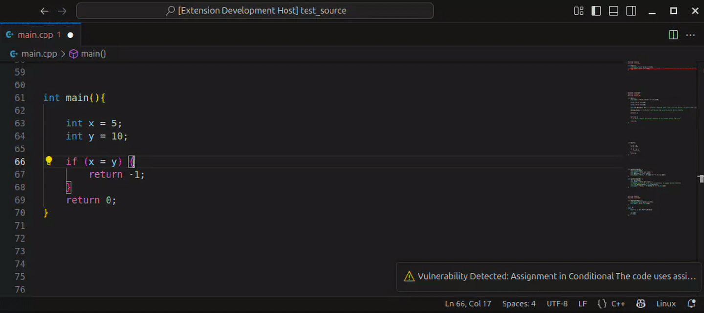

# Co Hacker - A Generative AI Secure Code Assistant

## Vision of Co Hacker

**Co Hacker** is a VSCode extension, built by developers for developers, designed to identify code vulnerabilities during development. It offers both manual and automatic "on-the-fly" solutions to insecure code.

The VSCode extension runs client-side within the IDE, sending code snippets to the Co Hacker server. The server leverages AI agents to detect insecure, undefined, or deprecated logic, and returns suggested fixes to the extension, which are then presented to the developer.

Learn more about how the server uses LLM tools like LangChain and LangGraph for code security analysis in the [Co-Hacker-Server](https://github.com/HeapHopper/co-hacker-server) repository.

## Features

### Inline Code Security Assistant

The inline assistant is Co Hacker’s main feature, providing real-time insights and suggestions for your code:

#### Code Vulnerability Detection

In the example above, the Co Hacker inline assistant detects three different code vulnerabilities in real time:

1. Using `gets(a)`—an insecure method for input reading without any input length check, which can cause **buffer overflow** vulnerabilities.
   - The inline assistant suggests using a safer standard method instead.

2. Although `strncpy(dst, src, len)` is generally considered secure, Co Hacker detects an **out-of-bounds (OOB)** vulnerability because `len` exceeds the size of `dst`.
   - The assistant recommends setting `len` to the size of the `dst` buffer minus one, reserving the last byte for the null terminator.

3. Scope awareness—`delete[] a;` is the correct way to release the memory for buffer `a`, but the user did not notice that this buffer was already released, leading to a **double free** vulnerability.
   - Co Hacker detects this and suggests removing the redundant line, preventing deletion of an already freed variable.

#### Upgrading Deprecated Code

Using deprecated methods can be as risky as handling raw memory. That’s why the inline assistant doesn’t just classify code as vulnerable or not—it also highlights code that is secure but should be modernized:

In the example above, Co Hacker suggests replacing the deprecated STL `std::auto_ptr<>` with the modern `std::unique_ptr<>`.

### Manual Code Security Assistant

You can also use Co Hacker manually by selecting a code snippet and requesting a security analysis:

In the top function, no vulnerabilities are found, so no inline suggestions are made and a pop-up informs the developer that the code is secure.

In the bottom function, which uses `gets()`, the insecure function is replaced with a safer STL alternative.

### Ask AI Tab

Sometimes you may want more than inline suggestions. For example, you might want a detailed analysis of your code or an explanation of why a vulnerability was detected. You can do this using the **Co Hacker - Ask AI** command:

In this example, we request a manual analysis of the `main()` function and Co Hacker modifies it. To understand the change, we use the Ask AI command, which opens a new tab with a detailed explanation of the issue in the code.

